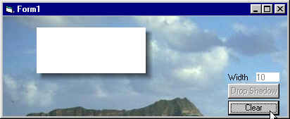



## Create Drop Shadows

### Description

'Develop a "drop shadow" around a picturebox. Module uses standard APIs so that code will work in all versions of Windows (Win95 to WinXP).

Produces true, variable width, gradient transparent drop shadows that become part of the original graphic.
 
### More Info
 
PictureBox, shadow width

'Procedure develops a "drop shadow" around a picturebox (sWidth in Pixels). The right and lower edge sections of the object container are stored in temporary Device Contexts and used as "background(s)" to create the shadow. These

sections are then added to the existing picturebox to create an integral effect.

Adjusted picturebox (includes gradient shadow)

             |
---                |---
**Submitted On**   |2004-04-13 12:19:28
**By**             |[Ed Porter](https://github.com/Planet-Source-Code/PSCIndex/blob/master/ByAuthor/ed-porter.md)
**Level**          |Advanced
**User Rating**    |4.9 (79 globes from 16 users)
**Compatibility**  |VB 6\.0
**Category**       |[Graphics](https://github.com/Planet-Source-Code/PSCIndex/blob/master/ByCategory/graphics__1-46.md)
**World**          |[Visual Basic](https://github.com/Planet-Source-Code/PSCIndex/blob/master/ByWorld/visual-basic.md)
**Archive File**   |[Create\_Dro1733064132004\.zip](https://github.com/Planet-Source-Code/ed-porter-create-drop-shadows__1-53129/archive/master.zip)

